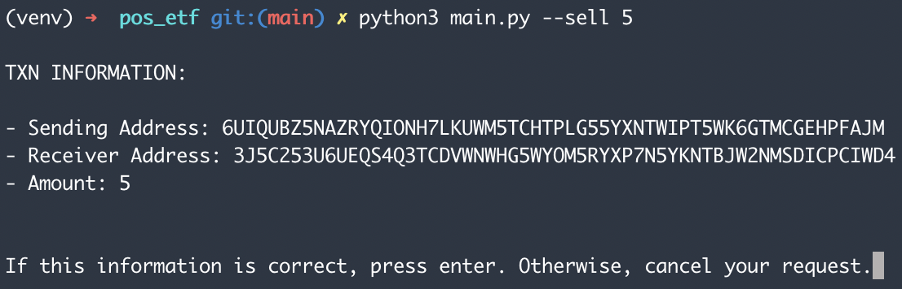

# Proof-of-Stake ETF
An ETF built on top of the Algorand Blockchain whose net value represents the top 10 Proof-of-Stake cryptocurrencies in circulation. This project allows you to purchase one diversified coin that represents these ten underlying assets, as opposed to buying the top ten Proof-of-Stake coins individually.

# Getting Started

## Authentication
First, you can connect a current Algorand Address with the following command:

```
python3 main.py signup
```
After, you will be prompted to enter your:
- Address
- Passphrase
- Account Name (if blank, the address is used)

You can also login to an already-connected account by running:
```
python3 main.py login
```

A list of account names will be rendered, and you can select which one to login to.


## Transactions

For this ETF, there are two possible transactions: `Buy` and `Sell`. To buy the ETF coin, you will use the following command:

```
 python3 main.py --buy [amount to buy]
```

After entering this command, the information for this transaction will be rendered on the screen. If it is correct, you can hit enter and your transaction will be approved in roughly 30 seconds. If the information is incorrect, you can hit `cntl + c` to cancel. 


To sell your ETF coin holdings, use the following command:

```
python3 main.py --sell [amount to sell]
```

The amount to sell must be less than the total holdings of your account. If it is not, an error will be throw, invalidating the transaction. Once you enter this command, the transaction information will be rendered on the screen. If it is correct, you can hit enter and your transaction will be submitted to the Algorand blockchain for confirmation.


## Viewing Holdings

This CLI also provides you with an easy way to view your ETF coin holdings. By using the following command:

```
python3 main.py --view
```

A list of your account names will be rendered. Once you select which one to retrieve data for, the total amount of ETF Coin holdings will be displayed in the terminal window.

